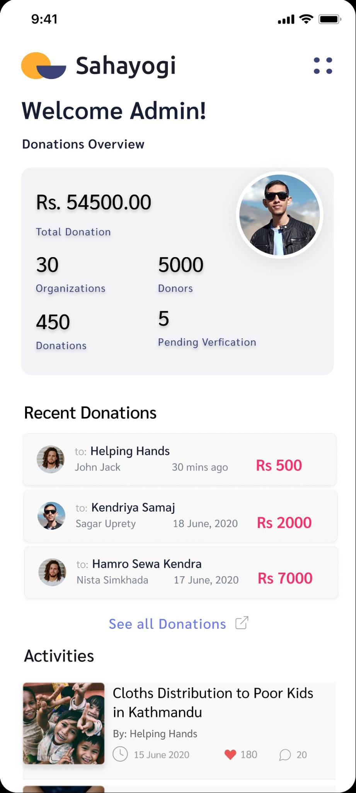

<h1 align="center">
 
</h1>
<h4 align="center"><b> Sahayogi Haath - Donatations Made Easy!</b></h4>
<div align="center">

</div>

## About ℹ️ 

Sahayogi Haath (Helping Hands) is a Flutter based Mobile Application that provides a single platform for users to search charity organizations, get detailed information and donate to the ones’ they love. This application also integrates eSewa payment gateways for seamless transactions. 

## Key Features 🧑‍💻

- Search Charity Organizations based on Location and Categories
- Receive Donations (if you are a verified charity organization)
- Make donations directly from the app (for donors)
- Admin Panel for donation verifcation, retrival and publishing activities

## Run Locally (Development Environment) ⚒️

#### Clone the repository and navigate to the project root directory. 
Make sure you have [Flutter](https://docs.flutter.dev/get-started/install) installed on your machine.

```bash
# Get packages
$ flutter pub get
```

```bash
# Run the applicaton
$ flutter run
```

```bash
# To build apk and ios bundle:
$ flutter build
```

## Tech Used 💻

- Frontend : Flutter
- Database : Cloud Firestore
- Authentication : Firebase Auth
- File Storage : Cloudinary
- Backend as a Service : Firebase

  
## Screenshots 

   
   
   
   
   
   


## Contributions

Contributions are highly appreciated. Please send a Pull Request with suggested changes or open an Issue to get things started!
